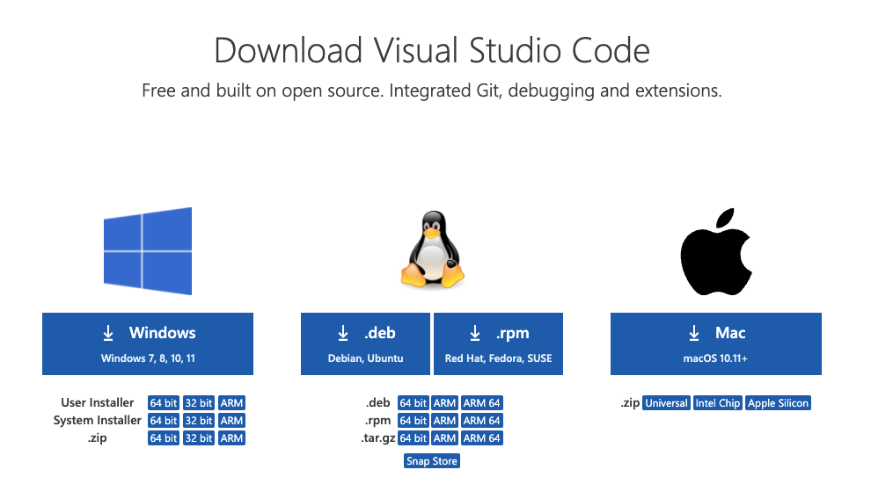
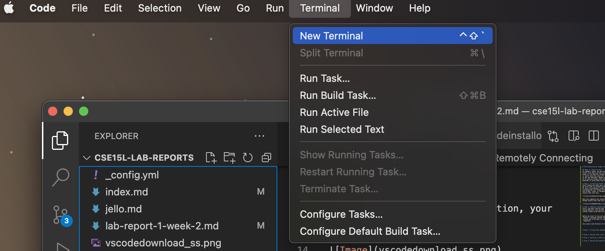
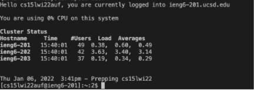
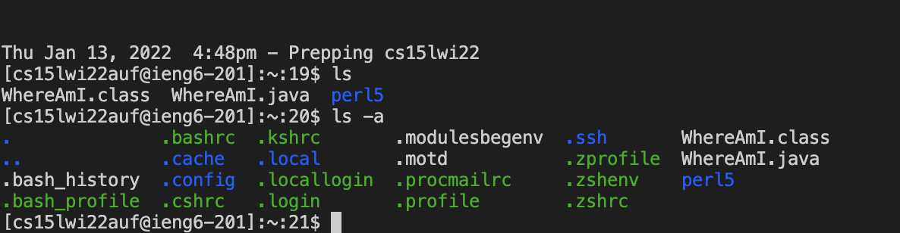
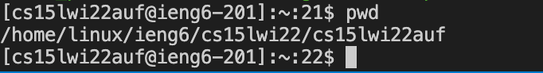
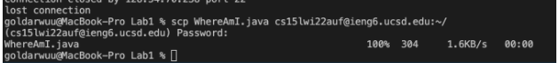
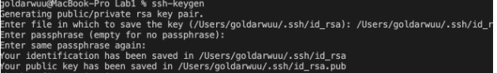
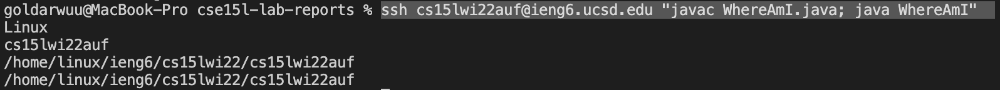

# Lab Report 1: SSH Connecting on ieng6! (Remote Access) 

## What is remote access? 
In layman's terms, we want to connect to a server from where we are (client side) in order to run specific things that we can't or would cause too much of a hassle to do on our own machines. Remote access allows us to work on things even though we are hundreds of miles away from a server! 

# Step 1: Installing Visual Studio Code
First figure out what your system is. 
We first want to install VScode, so go over to this [link](https://code.visualstudio.com/download) and choose which system you are on Mac, Linux, or Windows! Your window should look like this. 



Once you complete the installation, your VSCode should look like this. 


# Step 2: Remotely Connecting
First, you must retrive your course-specific ucsd account from [here](https://sdacs.ucsd.edu/~icc/index.php). You must update your password for this class to continue!  


Before we start if you are on Windows 
 Install a program called "OpenSSH", which allows you to be able to connect to other computers! 

Now, open a new Terminal as done below 


We want to now type this into the terminal, however keep in mind that the *xx* in this command is specific to your account.  

`ssh cs15lwi22xx@ieng6.ucsd.edu`

After running you should be prompted with a password(Do not worry if the password seems like its not entering! It is just hidden from you). 

Then you should be greeted with this screen. 



Key Note: The name on the left changed from my macbook pro to “cs15lwi22au@ieng6-201f” as I am logging in. This might indicate that I am on the 201 computer. 


Wow!!! Now you're logged into a computer in the CSE basement, congrats! 


# Step 3: Trying Some Commands
When we're writting programs and such, we want to be able to control and view everything at ease. Although visually is easier, it does become very slow overtime, so that's why we have to know some commands! 

Here are some 
* `cd` - Stands for change directory, you can use this to navigate through the directory. 
* `pwd` - Shows the working directory, this is incredibly useful for finding our current path. 
* `mkdir` - Makes a new directory! Simple! 
* `ls` - Shows us *all* the files, it excludes the hidden ones, but slap a '-a' on the back of that command and that gives us all the files

Here's an example of `ls` vs `ls -a`: 


And here is an example of `pwd`: 


# Step 4: Moving Files with scp
### What if we want to move files from one computer to another? 

For the most part it would defnitely be easier to copy the files on your computer and download them on the new one. 

**Fun Thing to Think About**: 
    Imagine if you had a huge source of data that you needed to move to a new location, would it be faster to take a plane to that location with the data or download it? How big should that data be for the plane ride to be faster than downloading? 

1. First create a file called WhereAmI.java and copy the following contents 
```
class WhereAmI {
  public static void main(String[] args) {
    System.out.println(System.getProperty("os.name"));
    System.out.println(System.getProperty("user.name"));
    System.out.println(System.getProperty("user.home"));
    System.out.println(System.getProperty("user.dir"));
  }
}
```
2. Now you want to copy the file over to the server by running this command, where *xx* is your unique account. 

`scp WhereAmI.java cs15lwi22*xx*@ieng6.ucsd.edu `

It will then prompt you for a password and will start downloading the file right after. 

Your output should look similar to what is shown here:


# Step 5: Setting an SSH Key
We're all about effieciency here, so having to enter our password each and everytime we want to ssh is quite time consuming. 

Luckily for us, there exists something called a SSH key! In layman terms, it gives us two files the public key and private key, which is able to ssh without entering the password since it knows this computer. 


1. Make sure you exit out of the ieng by typing 'exit' 
2. Type ssh-keygen


    2b. If you are on Windows, you must also include this step using ssh-add found [here](https://docs.microsoft.com/en-us/windows-server/administration/openssh/openssh_keymanagement#user-key-generation)
3. connect to the ieng using `ssh cs15lwi22*xx*@ieng6.ucsd.edu` and type `mkdir .ssh` 

4. We then exit using `exit` and type the following command 
`scp /Users/*zz*/.ssh/id_rsa.pub cs15lwi22@ieng6.ucsd.edu:~/.ssh/authorized_keys`
changing the value *zz* to your folder. This command will definitely depend on where your .ssh file is. 

Quick Fact: What do you think the period in front of ssh do? 

Ans: It makes it private! This is quite useful in file management because we don't always want to see every single file. 


# Step 6: Optimizing Remote Running
To make using ssh even faster, we can combine commands by running certain things together. 

The overall objective of this is to minimize time spent, so we have to optimize our overall number of keystrokes. 

Did you know that copying a file to another place and then running it can be done under 10 keystrokes (including all typing and mouse clicking)! 

Say I wanted to connect to ieng6, run javac WhereAmI.java and java WhereAmI on the server, then I can actually do it all in one line! 

Try this command: 
`ssh cs15lwi22auf@ieng6.ucsd.edu "javac WhereAmI.java; java WhereAmI" ` 

**Note:** I used quotation marks "" in order to run a command on the server and used ';' in order to seperate commands that I wanted it to run.

**Note:** Additionally, to minimize overall keystrokes, we can use the up and down keys to reuse commands that we have already used before! This saves plenty of time, since we don't always have to remember certain commands and accounts just to run our code. 


It should all look like this! 




## Happy Hacking! 