# Lab Report 2: Bugs and Symptoms while Coding! 

In this lab report, we will go over 3 issues that we encountered while working on a MarkdownParse reader, which reads links of a markdown file and outputs all the valid links. 

All files and images can also be found at this 
[repository](repo). 
## **Issue 1: If there is an image, instead of a link**

Given that a link format is similar to a image format, it is bound to fail at some point. 

link format = `[link](iamalink.com)` 
image format = `` 

The difference is a single exlamation point, although we can clearly see that, our computer can't...yet!


The file that triggered this failure was [new-file.md](https://github.com/goldarluu/markdown-parse/blob/main/new-file.md)
``` 

[link](googledoc.com)
```
### What was the *symptom?*
The expected behvior was that it would only print out the link and not the image, despite there being a clear difference. 
However, what happened was that it printed out both, as seen in the screen shot below (symptom). 
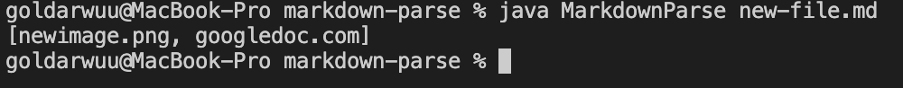

However with a quick fix by checking if the character before the nextopenbracket is an exlamation market and that it isn't the first index, we are able to decipher if the following line of code is an image or a link. If it is a link, then it will proceed to add it to the list of links, if not it doesn't.


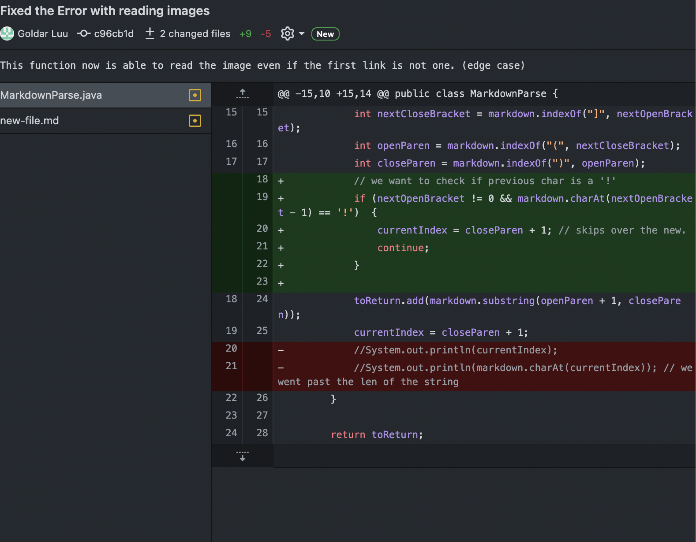

This gives us the following: 

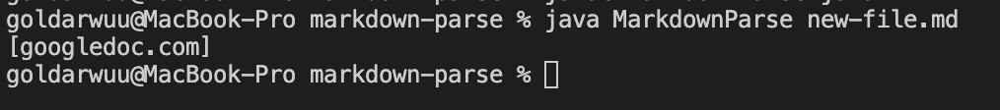

### Woohoo! We fixed our first bug! :joy:

---

## **Issue 2: Link is on the first Line**

By fixing our first issue with the image, a symptom that consequently came was that we no longer had an answer, just a reading out of bounds error. 

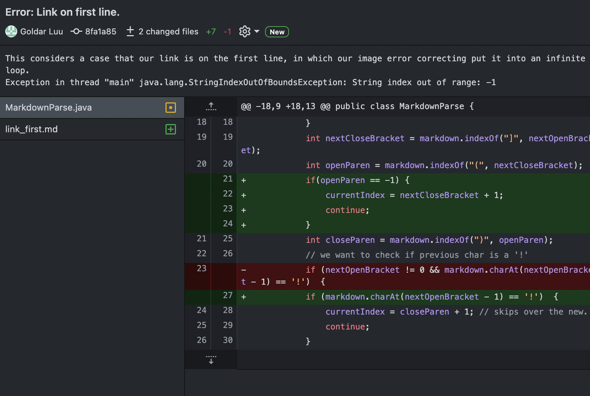


The file that triggered this failure was [link_first.md](https://github.com/goldarluu/markdown-parse/blob/main/link_first.md), which consisted of 
```
[link](googledoc.com)

```

### What was the *symptom*?
The expected behavior was that the program would have recognized the link and ignore the second line of code since that was an image. However, the displayed output(symptom) was that the program was giving us a string index out of range. Why? It was because each time we checked the previous character of the next openBracket, we were indexing a string that wasn't even there. In other words, since the first open bracket is at the 0th index, we were trying to access the -1th index, which simply wouldn't work.
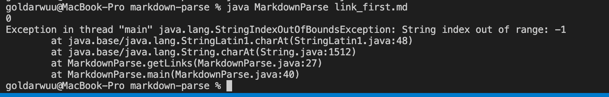


To fix this, we first checked if the nextOpenBracket != 0, since then it would both consider the cases where it is an image and would prevent us from checking out of bounds. 


And with this fix, we were able to print out the link in the first line without any problem, as seen below. 
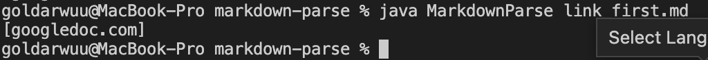


--- 

## **Issue 3: Test Cases? Who needs those!**

Well apparently, I do, because without test cases, I am pretty sure I wouldn't ever have finished my lab in general. And in turns out, it was a combination of ridiculous errors that anyone should've caught. Tests are there to allow y

Some preface is that no one else in my group had this error, where I was trying to compile my last JUnit test for an inccorectlink in the markdown file that had an invalid link format for a link.  

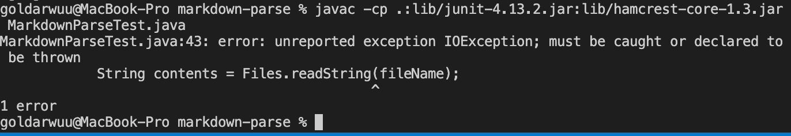

After tinkering with the program and looking over its symptoms, I finally realized that I didn't throw any IOexeption from the statement 
` error: unreport exceptionIOexception`, shown above. 

Then after fixing this error, I was able compile the program via `javac -cp .:lib/junit-4.13.2.jar:lib/hamcrest-core-1.3.jar MarkdownParseTest.java`

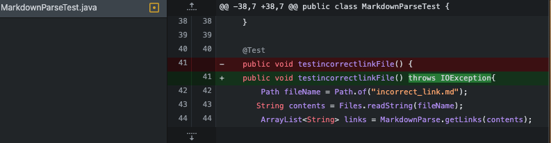 

Although the file was able to compile, the program still was failing exactly one testcase. 

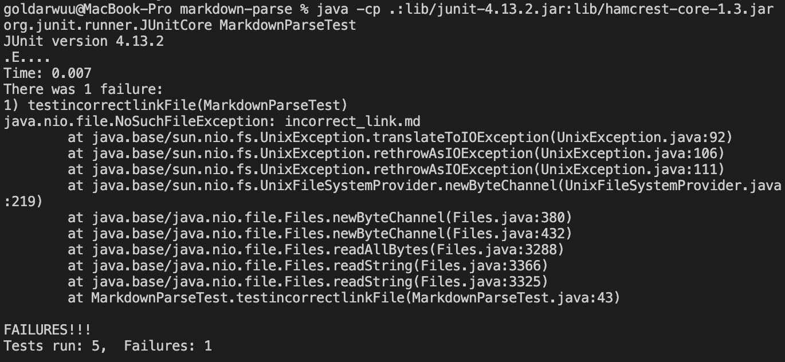

### **What in the world does all this mean?!** 
At first, I was crazily overwhelmed at what the symptom showed me, and I thought clearly I screwed up heavily in the MarkdownParse.java file. So my first fix was to attempt to run the same file in MarkdownParse, but for some reason, I couldn't run it! 

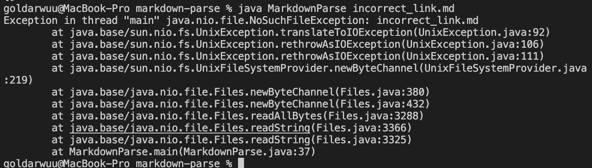

Now I was truly panicking, since I was falling behind the pace of my group and had no idea what my errors were. So I did, was to check if MarkdownParse worked for every single one of my previous test files, and then I made new tests files with the same exact content in the originals as well. Then I found out after creating an exact same copy of incorrect_link.png that I had been entering in the wrong file name!

Instead of `incorrectlink.png`, I put `incorrect_link.png` which was consistent with all my other test files. After I changed it back to what suppose to be, all the tests passed! 

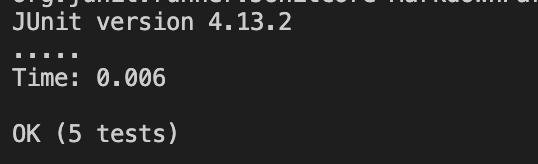

## A Key Takeaway 

Out of all the errors that we encountered in class, this final one took the most time for myself to figure out, and honestly it boiled down to a couple of things:
- Being inconsistent with my file naming 
- Not reaching out to my peers sooner because they were the ones who helped me with the IOException
- Being more careful to what I am writing down and understanding what it means
- Reading and understanding the errors!! The answer was right in the errors, so after going over the program a second time, I understood what those errors meant. One being `java.nio.file.noSuchFileException:incorrect_link.md` means that the file couldn't been found. 


