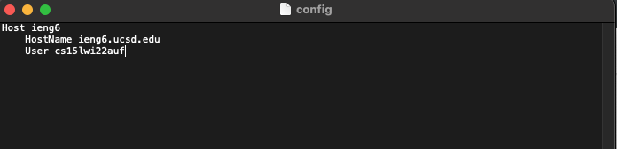
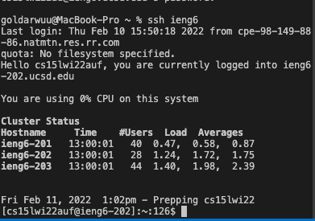
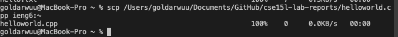

# Lab Report 3: Optimizing our Experience with SSH! 

### "Why waste time say lot word when few word do trick" - Kevin, The Office
[Here's Kevin Saying it](https://www.youtube.com/watch?v=VvPaEsuz-tY) 

In all seriousness, why do we need to continuously type in long commands when we want to connect to a server that is supposed to make things faster and seemless. 

That is why today, we will be streamlining the ssh configuration! 

In other words, we won't have to find and type this long phrase any longer!
`ssh cs15lwi22xx@ieng6.ucsd.edu` Whew! 


First we must find the ~./ssh/config file, this is responsible for all our ssh from our computer to any other server. In here you are able to adjust 
- when your computer times out of the ssh 
- how and what you type allows you connect 
- and countless other things! 

---

## Step 1) Locate your config file! 

As I am on a mac, I do not know how to exactly find the config file on windows, but the steps should be similar. 

1) First make the directory
`mkdir -p ~/.ssh`
2) Now we want to cd into that directory 
`cd ~./.ssh `
3) Open the config file with `open -t config`
- If the file does not exist then create it with `touch config` and then open it with `open -t config` 


[More Detailed Instructions here](https://stackoverflow.com/questions/54133300/how-to-access-and-modify-a-ssh-file-on-mac)

---

## Step 2) Copy and Paste! 

Now paste this snippet of code into your config file. I personally used *TextEdit* while modifying config files. 

```
Host ieng6
    HostName ieng6.ucsd.edu
    User cs15lwi22zzz (use your username)
```

It should look something like this: 


---

## Step 3) Log in as you always do 

Instead of using that long command, use this command instead. 

`ssh ieng6`

We were able to shorten the command significantly because we kind of made a way to type all that out behind the scenes! 

If all goes well, connecting should look normal as shown below: 


However, if you were unable to connected, replace the text in your config file to this, to allow your computer to know where the identity file is located. 
```
Host ieng6
    HostName ieng6.ucsd.edu
    User cs15lwi22zzz (use your username)
    IdentityFile ~/.ssh/id_rsa_ucsd
```

Step 4) Now to use scp with this command 

Just to throw in a little C programming, we will scp a file that states hello world in C++ to the ieng6 server 


```
#include <iostream> 

using namespace std; 


int main() 
{
    cout << "Hello World" << endl; 

    return 0; 
}
```

The command should go as follows: 
`scp /Users/goldarwuu/Documents/GitHub/cse15l-lab-reports/helloworld.cpp ieng6:~`

Replace my directory with your own and what files you want to create. 

Everything should look as follows 



---

That is it for this lab report! By learning this, small little things slowly add up, and as soon as we know it, we are coding gods! 