# Lab Report 4: Markdown-Parse Extreme Test Cases! 

## Two groups, who will prevail! 

In this week's Lab Report, we will be going over MarkdownParse from my own group and a group that I reviewed in last weeks. 

The objective of this MarkdownParse program is to parse through an `.md` file and grab all the valid formatted links. 

Given the following 3 snippets of code, we will test if the test will pass. The 3 test can be see below! 

#### Snippet 1
```
`[a link`](url.com)

[another link](`google.com)`

[`cod[e`](google.com)

[`code]`](ucsd.edu)
```

#### Snippet 2
```
[a [nested link](a.com)](b.com)

[a nested parenthesized url](a.com(()))

[some escaped \[ brackets \]](example.com)
```

#### Snippet 3
```
[this title text is really long and takes up more than 
one line

and has some line breaks](
    https://www.twitter.com
)

[this title text is really long and takes up more than 
one line](
    https://ucsd-cse15l-w22.github.io/
)


[this link doesn't have a closing parenthesis](github.com

And there's still some more text after that.

[this link doesn't have a closing parenthesis for a while](https://cse.ucsd.edu/


)

And then there's more text
```

Here is the output we are expecting accord to VSCode Preview! This essentially will tell us which links are "valid" and which links did not make it. 

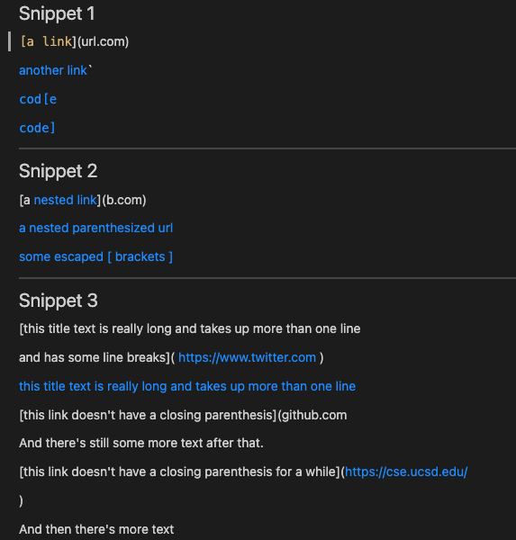

---
 
## How did I turn it into a test? What is wrong and what is correct? 

Through doing this lab, I started realizing that just because a link has an underline underneath it, and can link us to the right place; it doesn't mean it is formated correct!

**NOTE** : Putting `http://www.` in front of a link will automatically make it into a link. 

In Snippet 1, we expect to see the following links: 
` "%60google.com", "google.com", "ucsd.edu" ` 

In Snippet 2, we expect to see the nested link, but not the link that is around it(b.com should not be in our list.) Additionally, a nested parenthesized url will also be a valid link format, according to VSCode. Lastly, the case where the title of the link is "some escaped [brackets] " will also work". Thus, we expect to see the following links: 
` "a.com", "a.com(())", "example.com" `

Lastly, in Snippet 3, (the trickest one) the links we want to extract are: 

`"https://ucsd-cse15l-w22.github.io/"`

That is the only valid link according to both VScode and commonmark.org.

Below, I have attached the test I created in `MarkdownParseTest.java`: 
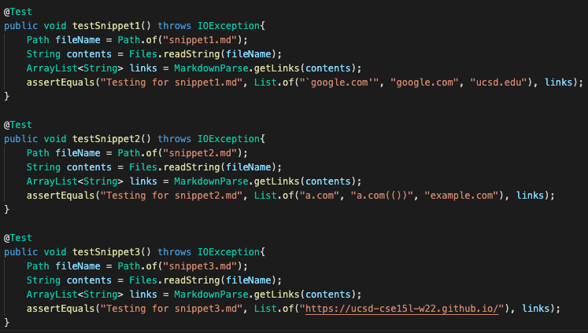


--- 


## We must know our errors before looking at others 

My repository is located [here](https://github.com/goldarluu/markdown-parse), however my group's respository that was sent for fixing can be found [here!])(https://github.com/LippsVega/markdown-parse). (They're basically identical)

Here is the outout, after running `make test`: 
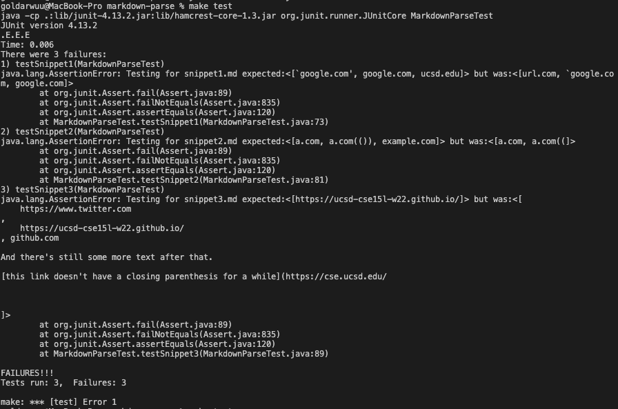

It's a sad day to be my program :(. All the tests had failed, but now we get to analyze them and find out why! 


### Snippet 1 

By running the command 
`jdb MarkdownParse snippet1.md`, I am able to see what was in the list after it terminated or you can look at the JUnit test I put below as well! And what I saw is that it copied down `url.com` '`google.com`(the backtick can be written as %60), and `google.com`. 

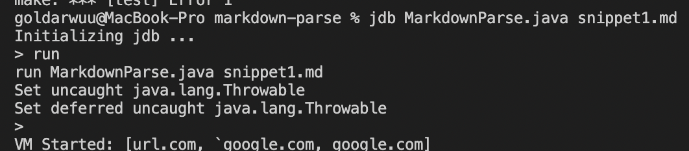 
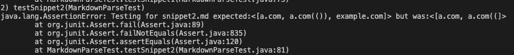


As one can see, our code got two things wrong: the `url.com` link and `ucsd.edu` link. This was because of the backticks were actually in the brackets themselves.


**Can it be fixed quickly?**
Since our program relies on finding the brackets and checking before it, fixing this issue would be multi-line, long and extensive fix. It is because you have to consider the fact that the backtick might start at *any* given place, which makes it hard to consider the infinite edge cases that exists. 

### Snippet 2 

Running a similar command as before:
`jdb MarkdownParse snippet2.md`, I am able to see what was in the list after it terminated or you can look at the JUnit test I put below as well! 

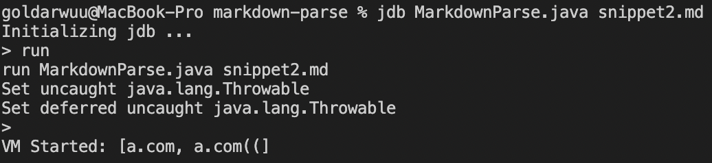


On a good note, we got the nested link, which is what VSCode preview wanted! However, it couldn't process `a.com(())` or `example.com` 

**Can it be fixed quickly?**
Honestly, since it passed the first case, which in my opinion is one of the harder edge cases, I believe this would be a simple fix. We would just have to find the last occurence of ")" before any other character  after encountering a "[".

---

### Snippet 3 


Running a similar command as before:
`jdb MarkdownParse snippet3.md`, I am able to see what was in the list after it terminated or you can look at the JUnit test I put below as well! 

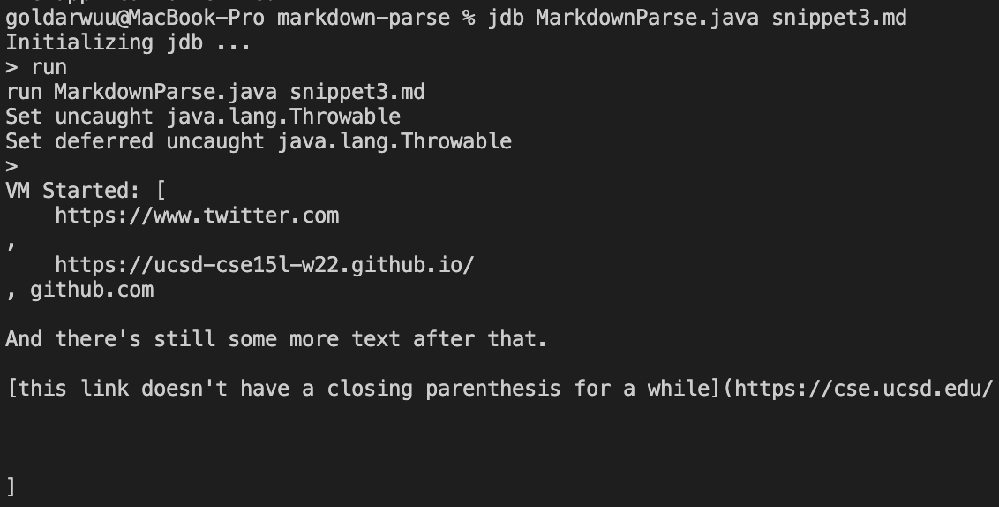 


**Can it be fixed quickly?**
My group occasionally each of had different answers at times because of line breaks, as they were interepreted different on Windows vs. Mac/Linux. I am currently on Macbook, so this would be a solution that may or may not work on windows. I believe that we could either find the link break and delete it or reformat the md file as we go. In either case, the fix would not be easy whatsoever. 

Something I did discover while finnicking around with this was that if I did 
```
[UCSD WEBSITE]( 
    http://stackoverflow.com
    )
```
it would work! Adding the http:// without any empty line breaks allows it to work. In fact, this [very important link for programmers](
    http://stackoverflow.com
    ) is formatted this way. 


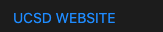

**Note for Snippet 3**

Through this lab I learned one very important thing: white spaces that arise from new lines. According to commonmark and VSCode preview, almost every line that I tested subsequently that had a line break in the title or in the link itself, did not work! However, for the point of this lab, we will not consider this to be in the **"correct"** format

--- 

## Now lets take a look at the other groups work! 

Their [repository](https://github.com/johnsonli010801/markdown-parse) could be found here! 

Here is the outout, after running `make test`: 


I was shocked myself! I had to check and recompile everything by manually typing, because they literally behave the same exact way. 


### Snippet 1 
Here is the output of the error from JUnit Testing:  
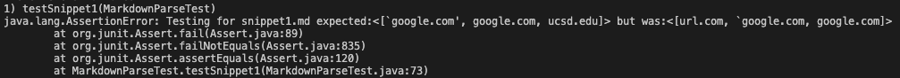

Exact same mistakes from my group, 

**Is there a quick fix?** 
Looking at their code, I believe that would not be a quick fix for the backtics. As from one of the lines that reads `if(markdown.indexof("!) == 0)`, I personally don't believe that considering case by case would be smart. Even if we ignored everything in the middle of two backticks, we would not pass the "another link`" edge case. 


### Snippet 2 
Here is the output of the error from JUnit Testing: 
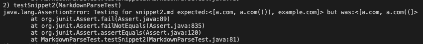

**Is there a quick fix?** 
Since the algorithm of this group is really similar to ours, I believe there is a quick fix with the same idea as ours. After we encounter a "(", we search all the way until we find the last ")" before an opening "[" that indicates a new link. 


### Snippet 3
Here is the output of the error from JUnit Testing: 
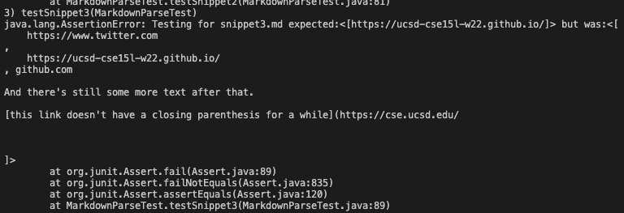


**Is there a quick fix?** 
As they had same output as us, I dont believe that there is one simple fix for the multiple lines that we have to consider. Stated before, there are differences between machines on how to interpret line breaks, as my group and I have experienced that first hand. 

## Thank you for reading this lab report, and I hope to see you in the next one! 
