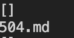

# Lab Report 5: Why don't my Tests Match! 


## Getting different results from two program that are "supposed" to perform the same?

Last week, we ran all these test files (can be found [here](https://github.com/goldarluu/markdown-parse/tree/main/test-files)) through both our and an instructors markdown parser. This was the command that I used to get the input into a txt file: 

`bash script.sh > result.txt` for the instructors results
and 
`bash script.sh > result1.txt` for my own results 

My script.sh file looks like the following: 
```
for file in test-files/*.md;
do
  java MarkdownParse $file
  echo "${file##*/}"
done
```
**NOTE** I added the `echo "${file##*/}"` in order to only grab the file name, instead of the entire pwd if I did `echo $file`.  

Then to compare the differences between the two files (one in my own personal markdown-parse and one in the instructors markdown-parse), I used this command: 

`diff mainMarkdownParse/markdown-parse/results.txt myMarkdownParse/markdown-parse/results.txt`

Now below, I have chosen 2 specific examples of where my markdownparse gave a different output than the instructors. 

And as always the repositories can be found [here](https://github.com/goldarluu/markdown-parse) for my groups implementation and [here](https://github.com/ucsd-cse15l-w22/markdown-parse) for the instructors implementation. 

<br>

--- 

<br>

## Test File that differs: 504.md

The contents in 504.md are as follows: 
```
[link](/url "title")
[link](/url 'title')
[link](/url (title))
```

Although we can use the `bash script.sh` command, I decided to actually use `java MarkdownParse test-files/504.md` to check my work! The reason why I did this was because my eyes could not focus on one exact case when I was either using the bash or diff commands. 

**NOTE:**  If you're like me, who struggles with bad eyesight, sometimes its better to run "smaller" commands in order to see the output more clearly. Definitely still use the other commands for efficiency though! 


This was my output: 


This was the instructors output: 

 


As one can see, for the instructors, it was completely empty and while ours contained the "links" that were embedded inside. 

Although the discussion of which program executed the parser *correctly* is up to discussion, I firmly believe that my groups implementation is correct because it was able to capture the correct "link", which was 
`
/url "title"
`

And here is the actual [link](/url "title") itself on this page: it should redirect you to this page, which doesn't actually exist though. 

 

The bug I found in the instructors code was that this if else block found at the bottom only runs in the else case and never adds the potential link. By adding a simple `"no!"` statement, I can see the problem. It may because of there being a space in the link itself, which actually does account for an interesting case because then now it is an interpretation of what you believe a *valid* link is. Additionally, I believe the instructors code needs to consider cases where there is a `/url` element because typically that is how you make a link. 


**Conclusion**

I think our implementation did its intended job of collecting what it thinks valid links are correctly, but the instructors implementation was able to catch these spaces, making it not a valid link, which is more practically correct. Being biased to the implementation that my group and I wrote, I think that ours is correct, but that's up to your interpretation! 

<br>
--- 

<br>

## Off to the next one! Test File that differs: 567.md

Here is what 567.md looks like: 
```
[foo](not a link)

[foo]: /url1
```

Wow another one in the 500? Now this is quite interesting. 

 

Hope that cheered you up to whoevers reading this right now! (whomever?)

My output: 


The instructors output: 


By looking at the output of both, we can see that both implementation passed the second part of the test where it states `[foo]: /url1`, which is good because a markdown file would not count that. However, the instructors implementation would be correct this time because when we input the first line into a markdown file, it doesn't recognize the words "not a link" as a *valid* link. 

Here it is shown below, as you can see, it is not a link at all. 

[foo](not a link)

A bug that we should consider is that if there is a space within the link, then the link should not be considered, but however it is weird because of the case we considered above, there was a space but that link was valid. So we have to come up with some intuitive way to consider the case that there can be spaces if there is a `/url` element, but no spaces if there isn't. 

--- 
<br>


*Note to the grader* (I can delete this if it violates any rules)

Thank you for grading our Lab Reports and getting it back to us as soon as you can! I hope this gif can cheer up your day! Good luck on all your finals!


 

